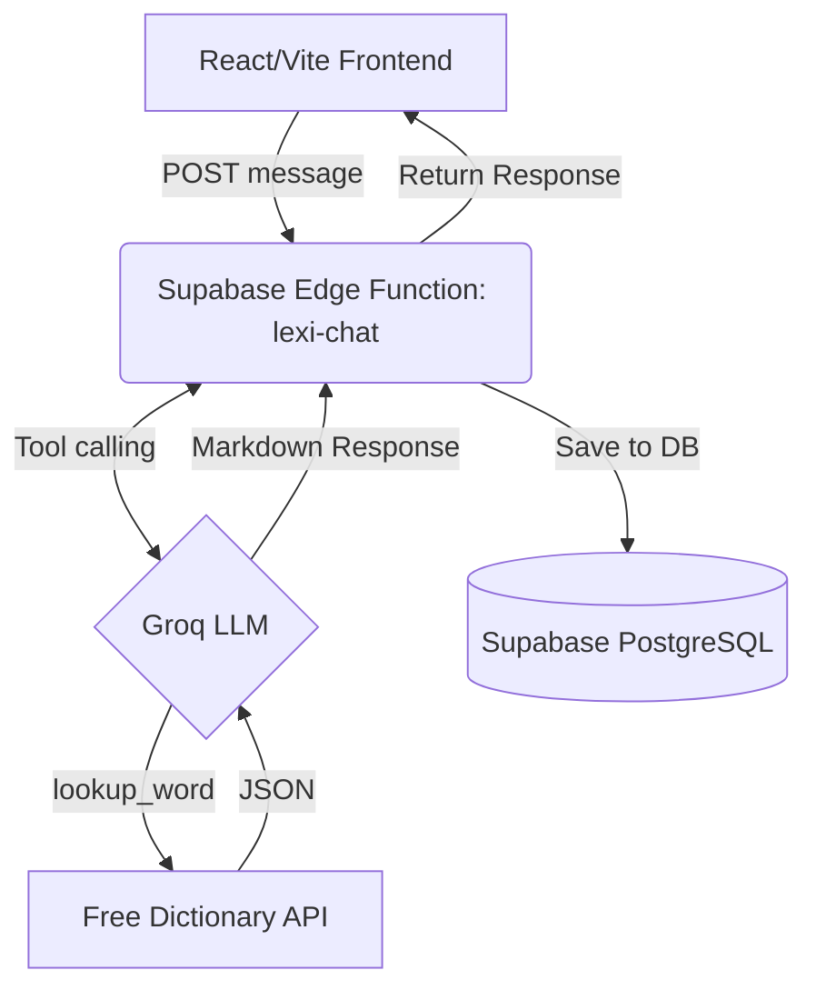

# LexiAgent Serverless Migration Architecture

## Current Architecture

LexiAgent is currently operating as a prototype with the following architecture:

*   **Frontend**: React, TypeScript, and Vite.
    *   **Routing**: React Router DOM (Single-page app where `Home.tsx` handles both the hero landing view and the active conversation view).
    *   **State Management**: Zustand (`src/store/historyStore.ts`) using `localStorage` persistence for session and chat history.
    *   **UI/Styling**: Tailwind CSS, Framer Motion for animations. Components include `WordResult.tsx` (dictionary typesetting), `ActivityTimeline.tsx` (agent process visualization), and `HistoryDrawer.tsx` (sidebar).
    *   **Parsing**: A custom Markdown parser (`src/lib/parser.ts`) extracts structured data from the LLM markdown response.
*   **Backend/Agent**:
    *   **n8n Webhook**: The frontend (`src/services/lexiAgentApi.ts`) sends `POST` requests to an n8n webhook (`https://sameer11123.app.n8n.cloud/webhook/lexiagent`).
    *   **Logic**: The n8n workflow currently handles the LLM orchestration and dictionary lookups, returning a Markdown-formatted response.
*   **Persistence**: Handled entirely on the client-side (Local Storage).

## Target Architecture

The application will be migrated to a production-ready, serverless architecture:

*   **Frontend**: React/Vite (Deployed to Vercel). The existing visual identity, UI components, and client-side parsing logic will be strictly preserved.
*   **Backend / Serverless**: 
    *   **Supabase Edge Function (`lexi-chat`)**: Replaces the n8n webhook. It will serve as the orchestration layer between the frontend, the LLM, and external APIs.
*   **AI Engine**: **Groq**. The Edge Function will communicate with the Groq API for extremely fast, low-latency LLM inference.
*   **Tooling**: The Edge Function will define a `dictionary_lookup` tool for the Groq model, which will execute requests against the **Free Dictionary API** for factual definitions.
*   **Database & Auth**: **Supabase** (PostgreSQL) will handle user authentication and persistent storage of conversation histories and saved words, replacing the local Zustand storage.

### Data Flow

## Migration Plan

1.  **Frontend Supabase Initialization**:
    *   Install `@supabase/supabase-js`.
    *   Create a Supabase client instance using the provided publishable key and project URL.
2.  **Database Migration (State & Auth)**:
    *   Design the PostgreSQL schema for users, sessions, and messages.
    *   Update `src/store/historyStore.ts` to sync data with Supabase instead of relying solely on `localStorage`.
3.  **Edge Function Development**:
    *   Initialize the Supabase CLI and create a new function `lexi-chat`.
    *   Implement the Groq API integration (via their official SDK or raw `fetch`).
    *   Implement tool calling within the Edge Function to intercept dictionary lookups and query the Free Dictionary API.
    *   Ensure the final response generated by Groq matches the specific Markdown structure expected by our custom `src/lib/parser.ts`.
4.  **Frontend API Update**:
    *   Refactor `src/services/lexiAgentApi.ts` to call the Supabase Edge Function (`supabase.functions.invoke('lexi-chat')`) rather than the n8n webhook.

## File Modifications

The following existing files will require modifications:

*   **`src/services/lexiAgentApi.ts`**: Replace the `fetch` call to the n8n webhook with a call to the Supabase Edge Function.
*   **`src/store/historyStore.ts`**: Integrate Supabase DB operations (inserting messages, fetching history) while maintaining the snappy local state.
*   **`package.json`**: Add `@supabase/supabase-js` and potentially `@supabase/auth-ui-react` if Auth UI is needed later.

## New Files to Create

*   **`src/lib/supabase.ts`**: To export the initialized Supabase client singleton.
*   **`.env`**: To store the Supabase URL, Anon Key, and Groq API Key.
*   **`supabase/functions/lexi-chat/index.ts`**: The core backend orchestration logic (Deno runtime).
*   **`supabase/config.toml`**: Supabase CLI configuration file (auto-generated when initializing).
