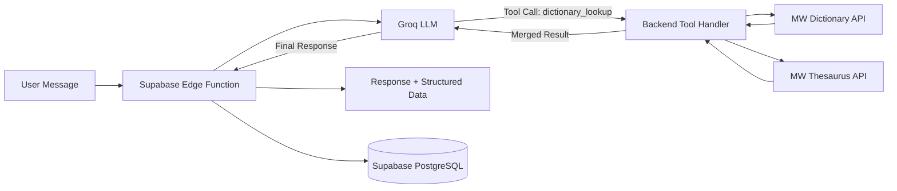

<p align="center">
  <h1 align="center">📚 LexiAgent</h1>
  <h3 align="center">Words, understood differently.</h3>
</p>

<p align="center">
An agentic AI dictionary and thesaurus that turns vocabulary lookup<br/>into a natural conversation.
</p>

<p align="center">
  
  
  
  
  
  
</p>

<p align="center">
  <a href="https://lexiagent.vercel.app"><strong>Live Demo</strong></a> · <a href="https://github.com/MSameer7-tech/Lexi-Agent"><strong>Repository</strong></a>
</p>

---

## Preview

> Screenshots coming soon.

---

## Why LexiAgent?

Traditional dictionaries are optimized for **lookup**. You enter a word, read one definition, and leave.

LexiAgent is designed for **exploration**.

```
"What does ephemeral mean?"
"How is it different from temporary?"
"Give me a literary example."
"What are its antonyms?"
```

It combines authoritative dictionary data from Merriam-Webster with a conversational AI layer powered by Groq, turning vocabulary into an interactive dialogue rather than a static page.

---

## Features

| | Feature | Description |
|---|---|---|
| 🤖 | **Agentic Dictionary** | Groq tool calling decides when to fetch dictionary data — the model reasons, then acts. |
| 📖 | **Structured Definitions** | Part-of-speech, meanings, and usage examples sourced from Merriam-Webster's Collegiate Dictionary. |
| 🔄 | **Conversational Exploration** | Ask follow-up questions about usage, nuance, etymology, and context. |
| 🔊 | **Pronunciation** | Phonetic notation and native audio playback from Merriam-Webster. |
| 🎤 | **Voice Input** | Speak your query using the Web Speech API — tap the mic and dictate. |
| 🔎 | **Synonyms & Antonyms** | Automatic thesaurus lookup merged into dictionary results. |
| 🧠 | **Personal Vocabulary** | Save words and build a personal collection. Word history tracks lookup frequency over time. |
| 💬 | **Cloud Conversations** | Authenticated users get persistent, paginated chat history across sessions and devices. |
| 📌 | **Pin & Organize** | Pin important conversations, rename them, search through your history. |
| 🔐 | **Secure Architecture** | All API keys remain server-side inside Supabase Edge Functions. Nothing leaks to the browser. |
| 🌗 | **Light & Dark Themes** | Carefully designed for both modes with synchronized global state. |
| ✨ | **Editorial UI** | Warm ivory palette, restrained motion via Framer Motion, and tactile typographic design. |

---

## How the Agent Works

LexiAgent uses an **agentic loop** — the LLM autonomously decides whether to invoke backend tools before composing its response.



**The flow:**

1. User sends a message from the React frontend.
2. The Edge Function forwards the message (with up to 12 messages of conversation context) to Groq.
3. If the LLM determines dictionary data is needed, it issues a `dictionary_lookup` tool call.
4. The Edge Function intercepts this and fetches **both** the Dictionary and Thesaurus from Merriam-Webster concurrently via `Promise.all`, merges synonyms and antonyms, and returns the combined result to the model.
5. Groq generates the final conversational response using the retrieved data.
6. The Edge Function persists the conversation and word history to Supabase, then returns the response along with structured dictionary data and agent event metadata.

Only one tool (`dictionary_lookup`) is exposed to the model. The thesaurus enrichment happens transparently on the backend. The agentic loop is capped at **3 iterations** per request. Any attempt to invoke an unregistered tool is rejected.

---

## Tech Stack

| Layer | Technology |
|---|---|
| Frontend | React 19 · TypeScript 6 · Vite 8 |
| Styling | Tailwind CSS 4 · clsx · tailwind-merge |
| State | Zustand 5 |
| Animation | Framer Motion 13 |
| Icons | Lucide React |
| Markdown | react-markdown |
| Dates | date-fns |
| Backend | Supabase Edge Functions (Deno 2) |
| Database | PostgreSQL 17 via Supabase |
| Auth | Supabase Auth (Email, Google, GitHub) |
| LLM | Groq (`openai/gpt-oss-20b`) |
| Dictionary | Merriam-Webster Collegiate Dictionary API |
| Thesaurus | Merriam-Webster Collegiate Thesaurus API |
| Linter | oxlint |
| Deployment | Vercel (frontend) · Supabase (backend) |

---

## Architecture

```
┌───────────────────────────────────┐
│          React Frontend           │
│  Routing · State · Auth · UI     │
└───────────────┬───────────────────┘
                │ authenticated request
                ▼
┌───────────────────────────────────┐
│     Supabase Edge Function        │
│  lexi-chat · Deno 2 · Rate Limit │
└───────┬───────────────┬───────────┘
        │               │
        ▼               ▼
┌──────────────┐ ┌─────────────────┐
│   Groq LLM   │ │ Merriam-Webster │
│  Tool Calling │ │ Dictionary &    │
│              │ │ Thesaurus APIs  │
└──────────────┘ └─────────────────┘
                │
                ▼
        ┌───────────────┐
        │   Supabase    │
        │ PostgreSQL 17 │
        │ Auth · RLS    │
        └───────────────┘
```

**Security boundary:** The browser never sees Groq or Merriam-Webster API keys. The frontend sends authenticated requests to the Edge Function, which holds all server-side secrets as Deno environment variables. Row Level Security on every database table ensures complete account isolation.

---

## Project Structure

```
Lexi-Agent/
├── public/                           # Favicon, MW attribution logos
├── src/
│   ├── components/
│   │   ├── agent/                    # ActivityTimeline — agent event visualization
│   │   ├── branding/                 # MerriamWebsterAttribution — required API attribution
│   │   ├── dictionary/              # WordResult — structured dictionary card
│   │   ├── history/                  # HistoryDrawer — sidebar with search, pin, rename, delete
│   │   └── ui/                       # Button, Input, MarkdownRenderer
│   ├── contexts/                     # AuthContext — session lifecycle, guest/cloud hydration
│   ├── layouts/                      # MainLayout — navbar, theme toggle, routing shell
│   ├── lib/                          # Supabase client, parser, motion utilities, utils
│   ├── pages/                        # Home, Auth, Vocabulary, Settings, History
│   ├── services/                     # lexiAgentApi — all Edge Function calls
│   ├── store/                        # Zustand stores (history, theme)
│   └── types/                        # TypeScript interfaces
├── supabase/
│   ├── functions/
│   │   └── lexi-chat/                # Edge Function: index.ts, groq.ts, tools/, prompts/
│   └── migrations/                   # 6 SQL migrations: schema, auth trigger, vocabulary,
│                                     #   word history RPC, pinning, pagination RPCs
├── .env.example
├── package.json
├── vite.config.ts
└── ARCHITECTURE.md
```

---

## Local Development

### Prerequisites

- Node.js ≥ 18
- [Supabase CLI](https://supabase.com/docs/guides/cli)
- A Supabase project
- API keys for [Groq](https://console.groq.com) and [Merriam-Webster](https://dictionaryapi.com)

### Setup

```bash
git clone https://github.com/MSameer7-tech/Lexi-Agent.git
cd Lexi-Agent
npm install
```

Create a `.env` file in the project root:

```env
VITE_SUPABASE_URL=your_supabase_project_url
VITE_SUPABASE_PUBLISHABLE_KEY=your_supabase_publishable_key
```

Start the dev server:

```bash
npm run dev
```

---

## Supabase Setup

Link your project and apply the database schema:

```bash
npx supabase login
npx supabase link --project-ref YOUR_PROJECT_REF
npx supabase db push
```

Deploy the Edge Function:

```bash
npx supabase functions deploy lexi-chat --no-verify-jwt
```

Set server-side secrets:

```bash
npx supabase secrets set GROQ_API_KEY=your_key
npx supabase secrets set MW_DICTIONARY_API_KEY=your_key
npx supabase secrets set MW_THESAURUS_API_KEY=your_key
```

---

## Environment Variables

**Frontend** (`.env`)

| Variable | Purpose |
|---|---|
| `VITE_SUPABASE_URL` | Supabase project URL |
| `VITE_SUPABASE_PUBLISHABLE_KEY` | Supabase publishable/anon key |

**Supabase Edge Function** (server-side secrets)

| Secret | Purpose |
|---|---|
| `GROQ_API_KEY` | Groq API authentication |
| `MW_DICTIONARY_API_KEY` | Merriam-Webster Dictionary access |
| `MW_THESAURUS_API_KEY` | Merriam-Webster Thesaurus access |
| `CORS_ALLOWED_ORIGIN` | *(Optional)* Restrict allowed origins. Defaults to `*` |

> **Security:** Server-side API keys must never appear in frontend `.env` files, Vite source code, or client-side requests. They are injected as Deno environment variables inside the Edge Function runtime only.

---

## Authentication & Data

LexiAgent supports three access modes:

- **Email/Password** — standard Supabase Auth registration and login.
- **OAuth** — Google and GitHub sign-in via Supabase Auth.
- **Guest** — unauthenticated users can explore words with ephemeral local-only sessions. New visitors are redirected to the auth screen; they can explicitly choose to continue as guest.

**For authenticated users:**

- Conversations, messages, saved words, and word history are persisted in PostgreSQL.
- **Row Level Security** is enabled on every table (`profiles`, `conversations`, `messages`, `saved_words`, `word_history`). Users can only read and write their own data.
- Chat history is paginated via database RPCs (`get_conversations_page`, `get_messages_page`) using keyset cursor pagination.
- Word history tracks lookup frequency (`lookup_count`) and timestamps (`first_seen_at`, `last_seen_at`) with atomic upserts.
- Conversations can be pinned, renamed, searched, and deleted.

**For guests:**

- Conversations are stored in `localStorage` and do not persist across browsers.
- The LLM and dictionary tools work identically; only persistence is local.

---

## Agent Tooling

The Edge Function exposes a single tool to Groq:

| Tool | Exposed to LLM | Source |
|---|---|---|
| `dictionary_lookup` | ✅ Yes | Merriam-Webster Collegiate Dictionary API |

When this tool fires, the backend **also** fetches the Merriam-Webster Thesaurus API in parallel and merges the results before returning them to the model. This design keeps the tool interface simple for the LLM while enriching every lookup with synonyms and antonyms automatically.

**Returned dictionary data includes:** word, phonetic notation, audio pronunciation URLs, definitions grouped by part of speech with examples, stems, deduplicated synonyms, and antonyms.

Tool execution is restricted: any attempt to call an unregistered tool returns `"Tool not found or not permitted"`. The agentic loop terminates after **3 iterations** maximum, with a **15-second timeout** on each Groq API call and **8-second timeouts** on Merriam-Webster requests.

**Response structure:**

```json
{
  "success": true,
  "response": "Conversational markdown response",
  "sessionId": "uuid",
  "dictionary": {
    "word": "ephemeral",
    "phonetic": "/ɪˈfem(ə)rəl/",
    "pronunciations": [{ "phonetic": "...", "audioUrl": "..." }],
    "meanings": [{ "partOfSpeech": "adjective", "definitions": [...] }],
    "synonyms": ["transient", "fleeting"],
    "antonyms": ["permanent", "enduring"]
  },
  "events": [
    { "type": "tool_call", "tool": "dictionary_lookup", "input": "ephemeral" },
    { "type": "tool_result", "tool": "dictionary_lookup", "success": true }
  ]
}
```

---

## Security

| Protection | Implementation |
|---|---|
| Server-side secrets | Groq and MW API keys are Deno env vars, inaccessible from the browser |
| Row Level Security | Enabled on all 5 database tables with per-user policies |
| Input validation | Message capped at 5,000 chars; word at 100; note at 500 |
| Rate limiting | In-isolate sliding window: 50 requests/minute per identifier |
| Tool restriction | Only `dictionary_lookup` is permitted; all others are rejected |
| Loop cap | Agentic loop terminates after 3 iterations maximum |
| Auth verification | Bearer token validated via `supabase.auth.getUser()` for all data operations |
| CORS | Configurable via `CORS_ALLOWED_ORIGIN` environment variable |
| Request timeouts | 15s on Groq API calls, 8s on Merriam-Webster requests |
| Cascade deletes | Deleting a conversation cascades to all its messages via FK constraints |

---

## Design Philosophy

LexiAgent intentionally avoids the typical AI dashboard aesthetic.

Vocabulary is treated as an **editorial experience** rather than a utility screen. The interface draws from book design and magazine typesetting — warm ivory backgrounds, restrained serif-adjacent typography, deliberate whitespace, and quiet micro-interactions via Framer Motion.

The dictionary card uses an asymmetric 40/60 split layout. Cards feel tactile. Transitions feel intentional. The dark theme is crafted as its own palette, not an inverted afterthought.

---

## Scripts

```bash
npm run dev       # Start Vite dev server
npm run build     # TypeScript check + production build
npm run lint      # Run oxlint
npm run preview   # Preview production build locally
```

---

## Deployment

| Component | Platform |
|---|---|
| Frontend | [Vercel](https://vercel.com) — automatic deploys from `main` |
| Edge Function | [Supabase](https://supabase.com) — deployed via `supabase functions deploy` |
| Database & Auth | [Supabase](https://supabase.com) — managed PostgreSQL 17 with RLS |

**Live:** [lexiagent.vercel.app](https://lexiagent.vercel.app)

---

## Roadmap

- [ ] Expanded language support
- [ ] Vocabulary learning modes and spaced repetition
- [ ] Additional pronunciation variants
- [ ] Richer linguistic tools (etymology, word frequency, usage over time)

---

## Attribution

Dictionary and thesaurus data provided by the [Merriam-Webster API](https://dictionaryapi.com). LexiAgent includes the required Merriam-Webster logo attribution in both light and dark themes via a dedicated `MerriamWebsterAttribution` component.

---

## Acknowledgements

[Groq](https://groq.com) · [Supabase](https://supabase.com) · [Merriam-Webster](https://dictionaryapi.com) · [React](https://react.dev) · [Vite](https://vite.dev)

---

## License

This project is licensed under the MIT License.
