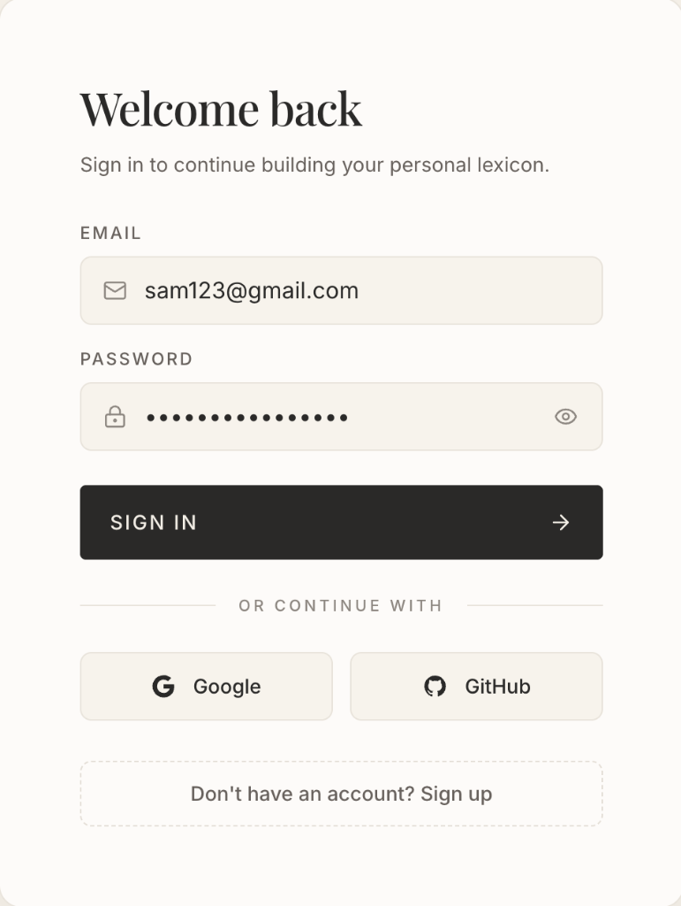
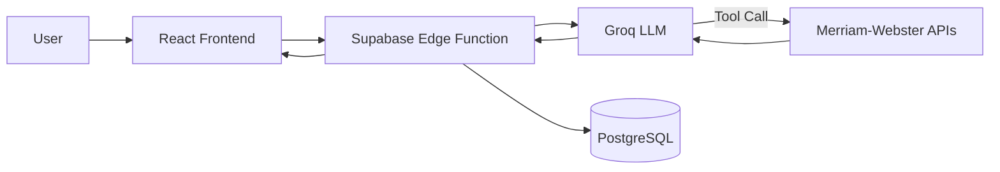

<p align="center">
  <h1 align="center">📚 LexiAgent</h1>
  <h3 align="center">Words, understood differently.</h3>
</p>

<p align="center">
LexiAgent is an agentic AI dictionary and thesaurus that combines Merriam-Webster's dictionary data with Groq-powered conversational AI to turn vocabulary lookup into an interactive exploration.
</p>

<p align="center">
  <a href="https://lexiagent.vercel.app"><strong>Live Demo →</strong></a>&nbsp;&nbsp;·&nbsp;&nbsp;<a href="https://github.com/MSameer7-tech/Lexi-Agent"><strong>GitHub</strong></a>
</p>

<br/>

---

## ✦ Preview


<table>
  <tr>
    <td></td>
    <td></td>
  </tr>
  <tr>
    <td align="center"><em>Dictionary result with definitions, pronunciation, and follow-up input</em></td>
    <td align="center"><em>Personal vocabulary — recent words and saved collection</em></td>
  </tr>
</table>

<p align="center">
  
</p>
<p align="center"><em>Editorial sign-in with Google, GitHub, and email</em></p>

---

## ✦ What makes LexiAgent different

🤖 **Agentic lookup** — Groq autonomously decides when dictionary data is needed and invokes the tool.

📖 **Rich word intelligence** — Definitions, examples, phonetics, audio pronunciation, synonyms, and antonyms from Merriam-Webster.

💬 **Conversational exploration** — Ask follow-up questions instead of isolated searches. Continue the dialogue.

🧠 **Personal vocabulary** — Save words, track lookup history, and build your lexicon across sessions.

🎤 **Voice input** — Speak your query using native Web Speech API.

---

## ✦ How it works



The user sends a message. The Edge Function routes it to Groq, which can autonomously invoke a dictionary tool to fetch real definitions and thesaurus data from Merriam-Webster. The final response — along with structured word data — is persisted and returned to the frontend.

---

## ✦ Tech Stack

| Layer | Technology |
|---|---|
| Frontend | React 19 · TypeScript · Vite |
| Styling | Tailwind CSS 4 · Framer Motion |
| State | Zustand |
| Backend | Supabase Edge Functions (Deno) |
| AI | Groq |
| Dictionary | Merriam-Webster Dictionary & Thesaurus APIs |
| Database & Auth | Supabase (PostgreSQL · RLS · OAuth) |
| Deployment | Vercel + Supabase |

---

## ✦ Run locally

```bash
git clone https://github.com/MSameer7-tech/Lexi-Agent.git
cd Lexi-Agent
npm install
```

Create `.env`:

```env
VITE_SUPABASE_URL=your_supabase_url
VITE_SUPABASE_PUBLISHABLE_KEY=your_supabase_key
```

> Groq and Merriam-Webster API keys belong in [Supabase Edge Function secrets](https://supabase.com/docs/guides/functions/secrets), not in frontend environment variables.

```bash
npm run dev
```

---

## ✦ Project

```
src/
├── components/       # WordResult, ActivityTimeline, HistoryDrawer
├── pages/            # Home, Auth, Vocabulary, Settings
├── store/            # Zustand (history, theme)
├── services/         # Edge Function API client
└── lib/              # Supabase client, parser, motion

supabase/
├── functions/
│   └── lexi-chat/    # Agent orchestration, Groq, MW tools
└── migrations/       # PostgreSQL schema, RLS, RPCs
```

---

## ✦ Live

**[lexiagent.vercel.app](https://lexiagent.vercel.app)** · **[GitHub](https://github.com/MSameer7-tech/Lexi-Agent)**

---

## ✦ Attribution

Dictionary and thesaurus data provided by the [Merriam-Webster API](https://dictionaryapi.com). LexiAgent follows the required attribution and branding guidelines.

---

## ✦ License

MIT
