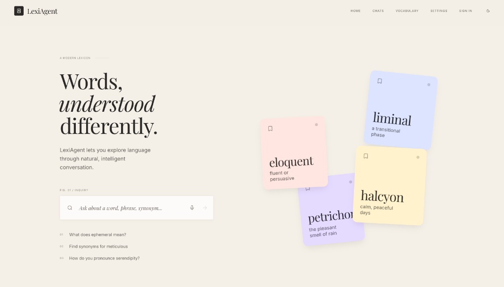
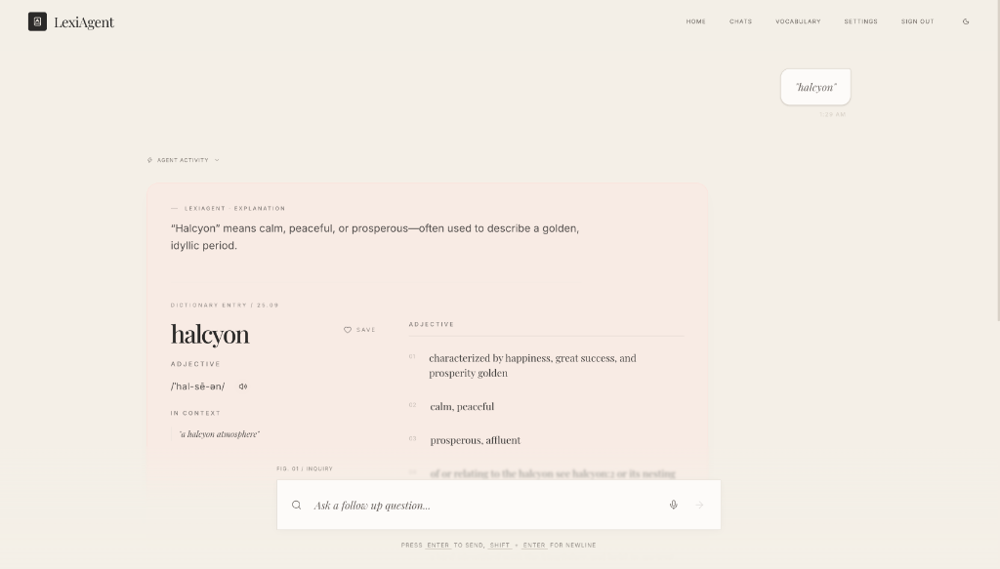
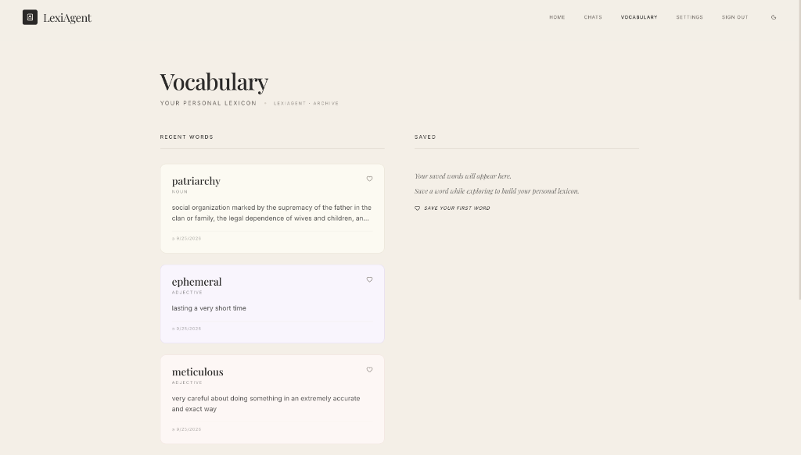
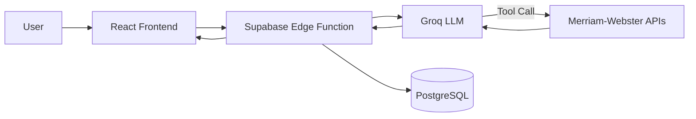

<p align="center">
  <h1 align="center">📚 LexiAgent</h1>
  <h3 align="center">Words, understood differently.</h3>
</p>

<p align="center">
An agentic AI dictionary that turns vocabulary lookup into a conversational learning experience.
</p>

<p align="center">
  
  
  
  
  
  
</p>

<p align="center">
  <a href="https://lexiagent.vercel.app"><strong>Live Demo →</strong></a>&nbsp;&nbsp;·&nbsp;&nbsp;<a href="https://github.com/MSameer7-tech/Lexi-Agent"><strong>GitHub</strong></a>
</p>

<br/>

<p align="center">
  
</p>

<table>
  <tr>
    <td></td>
    <td></td>
  </tr>
</table>

---

## ✦ Features

🤖 **Agentic lookup** — Groq autonomously decides when to fetch dictionary data and invokes the tool.

📖 **Rich word intelligence** — Definitions, examples, pronunciation audio, synonyms, and antonyms from Merriam-Webster.

💬 **Conversational** — Ask follow-up questions. Continue the dialogue instead of isolated searches.

🧠 **Personal vocabulary** — Save words, track lookup history, build your lexicon across sessions.

🎤 **Voice input** — Speak your query using native Web Speech API.

🌗 **Light & dark** — Carefully designed editorial themes with warm ivory palette and tactile motion.

---

## ✦ How it works



User sends a message. The Edge Function routes it to Groq, which can autonomously invoke a dictionary tool to fetch definitions and thesaurus data from Merriam-Webster. Structured word data and the conversational response are persisted and returned to the frontend. All API keys stay server-side.

---

## ✦ Tech Stack

| Layer | Technology |
|---|---|
| Frontend | React 19 · TypeScript · Vite · Tailwind CSS 4 |
| Animation | Framer Motion |
| State | Zustand |
| Backend | Supabase Edge Functions (Deno) |
| AI | Groq |
| Dictionary | Merriam-Webster Dictionary & Thesaurus APIs |
| Auth & DB | Supabase (PostgreSQL · Row Level Security · OAuth) |
| Deployment | Vercel + Supabase |

---

## ✦ Quick Start

```bash
git clone https://github.com/MSameer7-tech/Lexi-Agent.git
cd Lexi-Agent
npm install
```

Create `.env`:

```env
VITE_SUPABASE_URL=your_supabase_url
VITE_SUPABASE_PUBLISHABLE_KEY=your_supabase_key
```

```bash
npm run dev
```

> Backend secrets (Groq, Merriam-Webster) are configured in [Supabase Edge Function secrets](https://supabase.com/docs/guides/functions/secrets) and are never exposed to the browser.

---

<p align="center">
  <strong><a href="https://lexiagent.vercel.app">lexiagent.vercel.app</a></strong>
</p>

---

<p align="center">
Dictionary and thesaurus data provided by the <a href="https://dictionaryapi.com">Merriam-Webster API</a>.<br/>
Licensed under MIT.
</p>
